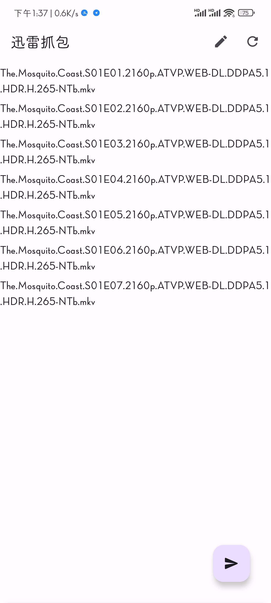

# MediaPluginXunlei
【NAS套件】迅雷抓包插件
- 现已采用ASF支持非ROOT方式，ROOT方式见[这里](https://github.com/PPeanutButter/MediaPluginXunlei/tree/58c53aa5aa11cd5da84deb01794ed73289e0ffcf)
# 使用步骤
1. 安装软件。
2. 迅雷官方App`->`云盘取回`->`开始下载后暂停。
3. 打开软件`->`右上角设置`->`设置服务器(`见【NAS套件】服务器端`)地址
3. 打开软件`->`右上角刷新`->`选择用户`->`右下角发送。

